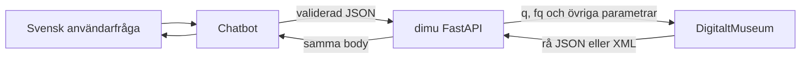

# dimu

`dimu` ansluter Python-program och chatbotar till DigitaltMuseums publika API.
Biblioteket har två lager:

1. `DimuClient` skickar HTTP-anrop med en återanvändbar `httpx.Client`.
2. Den valfria FastAPI-tjänsten gör samma klient tillgänglig över HTTPS för en
   separat chatbot.

Pydantic validerar frågan innan den skickas. DigitaltMuseums lyckade sök- och
objektsvar valideras, normaliseras eller förkortas däremot inte. Nya eller
okända upstream-fält följer därför automatiskt med.

## Börja här

- [Installation och konfiguration](installation.md) beskriver paket och
  miljövariabler.
- [Sökguiden](search.md) visar både säkra strukturerade frågor och fullständig
  rå Solr-syntax.
- [OpenAI och chatbotar](openai.md) innehåller ett komplett verktygsflöde.
- [HTTP-API](api.md) dokumenterar endpoints, autentisering och felkoder.

## Transparenslöftet

För `search`, `artifact` och råa samlingslistor returnerar klienten ett
`httpx.Response`. FastAPI-proxyn vidarebefordrar dess framgångsrika body utan
att läsa och skriva om JSON eller XML. Transportkomprimering, hop-by-hop-rubriker
och `Content-Length` kan ändras, men datainnehållet gör det inte.

Den AI-vänliga samlingslistan är det enda avsiktligt tolkade svaret. Dess råa
XML finns alltid på `/v1/collections/{country}/raw`.
