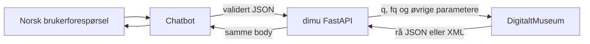

# dimu

`dimu` kobler Python-programmer og chatboter til DigitaltMuseums offentlige
API. Biblioteket har to lag:

1. `DimuClient` sender HTTP-kall med en gjenbrukbar `httpx.Client`.
2. Den valgfrie FastAPI-tjenesten gjør den samme klienten tilgjengelig over
   HTTPS for en separat chatbot.

Pydantic validerer spørringen før den sendes. Vellykkede søke- og objektsvar
fra DigitaltMuseum blir derimot ikke validert, normalisert eller forkortet. Nye
eller ukjente felt fra oppstrømstjenesten følger derfor automatisk med.

## Begynn her

- [Installasjon og konfigurasjon](installation.md) beskriver pakker og
  miljøvariabler.
- [Søkeguiden](search.md) viser både sikre, strukturerte spørringer og komplett
  rå Solr-syntaks.
- [OpenAI og chatboter](openai.md) inneholder en komplett verktøyflyt.
- [HTTP-API](api.md) dokumenterer endepunkter, autentisering og feilkoder.

## Løftet om transparens

For `search`, `artifact` og rå samlingslister returnerer klienten en
`httpx.Response`. FastAPI-proxyen videresender den vellykkede body-en uten å
lese og skrive om JSON eller XML. Transportkomprimering, hop-by-hop-headere og
`Content-Length` kan endres, men datainnholdet gjør det ikke.

Den AI-vennlige samlingslisten er det eneste svaret som med hensikt blir
tolket. Rå XML er alltid tilgjengelig på
`/v1/collections/{country}/raw`.
